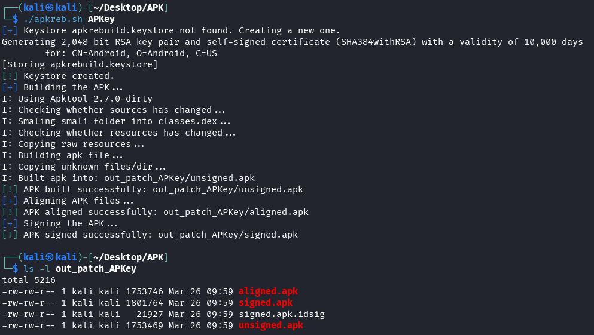

# 👾 Android Toolkit 🛠️

While pentesting I tend to automate repetitive tasks. This collection contains the tools and scripts I create while testing Android apps.  

## AVD-3310

Simple AVD manager to start and stop Android emulators.

TODO:
- Add automation for certificate installation
- Add automation for Frida server intallation

## APKRebuild

Simple bash script to automatically rebuild, zipalign and sign APKs.

Usage: `./apkreb.sh <decompiled_apk_directory/>`

